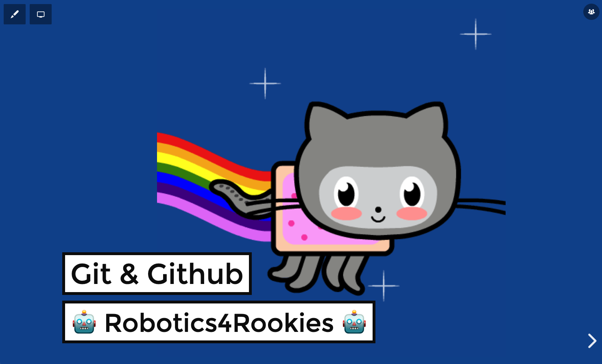

# slides-taller-github-Robotics4Rookies

## 🤔 Sobre el taller

Taller sobre Git y GitHub - Robotics4Rookies. 14 de Enero 2021

## 📹 Videos

- [GitHub 4 Rookies | GitHub con Ulises Gascon](https://youtu.be/3Z4vRZ0rjDg?t=211)

## 📚 Presentaciones

- [Slides | Taller de github para Robotics4Rookies](https://slides.ulisesgascon.com/github-workshop-for-robotics4rookies/)

## 🗂 Recursos
### Github

#### Octocats
- [Build Your Own Octocat](https://myoctocat.com/)
- [Octodex](https://octodex.github.com/)

#### Guides
- [Github Guides: Hello World](https://guides.github.com/activities/hello-world/)
- [GitHub Guides: Mastering Markdown](https://guides.github.com/features/mastering-markdown/)
- [Github Guides: Be Social](https://guides.github.com/activities/socialize/)
- [Github Guides: Mastering Issues](https://guides.github.com/features/issues/)
- [GitHub Guides: Getting Started with GitHub Pages](https://guides.github.com/features/pages/)
- [GtiHub Guides: Documenting your projects on GitHub](https://guides.github.com/features/wikis/)
- [GitHub Guides: Understanding the GitHub flow](https://guides.github.com/introduction/flow/)
- [GitHub GuideS: Forking Projects](https://guides.github.com/activities/forking/)

### Extras
- [Videos: GitHub Training & Guides](https://www.youtube.com/githubguides)
- [GitHub Help](https://docs.github.com/en)
- [Guías de código abierto](https://opensource.guide/es/)
- [How to Contribute to Open Source](https://opensource.guide/how-to-contribute/)
- [Importing your projects to GitHub](https://docs.github.com/en/free-pro-team@latest/github/importing-your-projects-to-github)
- [Hacktoberfest](https://hacktoberfest.digitalocean.com/)

### Git
- [Guía sencilla de Git](http://rogerdudler.github.io/git-guide/index.es.html)
- [Documentación de Git](https://git-scm.com/docs)
- [Git Extra](https://git-scm.com/doc/ext)
